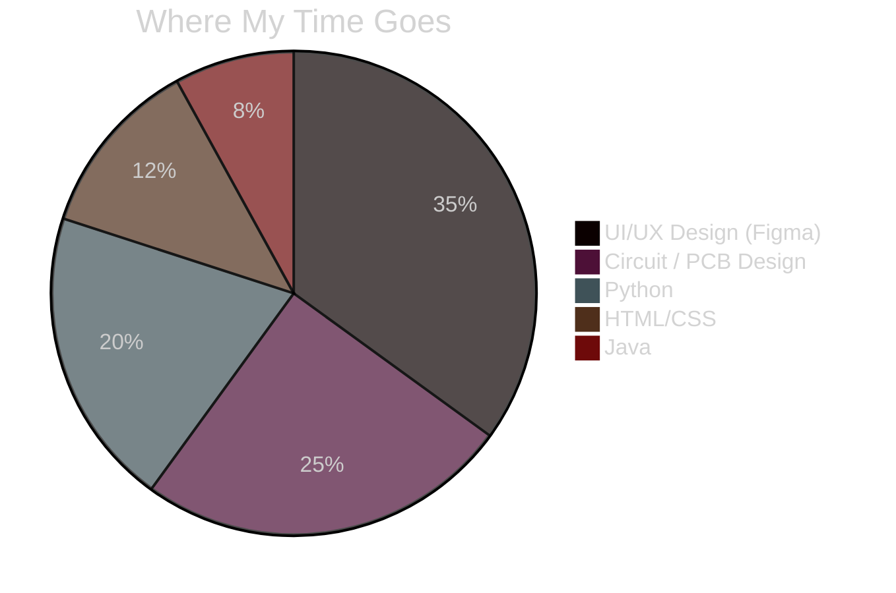
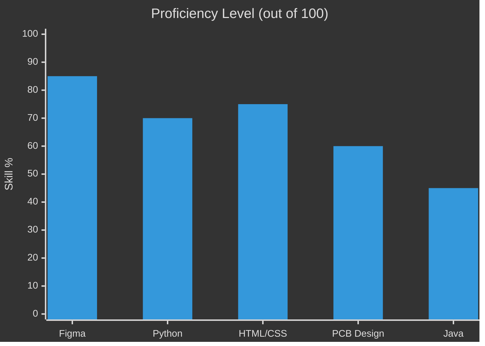
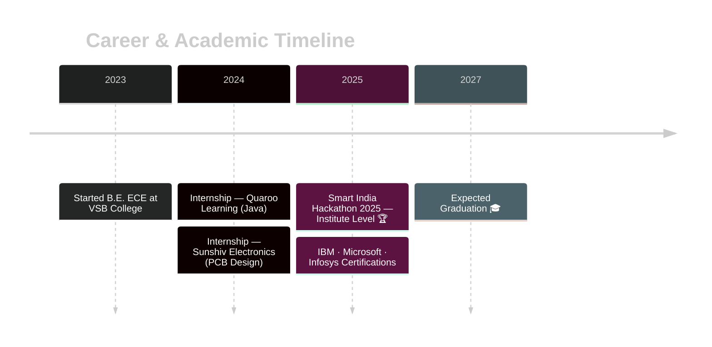

  <h3>🎨 Designing Interfaces by Day, Debugging Circuits by Night ⚡</h3>   

 

  

 

## 🧭 About Me

> Final-year **B.E. Electronics and Communication Engineering** student at V.S.B College of Engineering Technical Campus, Coimbatore — CGPA **8.41**.
> I move between **Figma frames and circuit boards**, treating design and hardware as one continuous practice — the same instinct for clarity that shapes a wireframe also shapes a circuit board.

 

## 🥧 Skill Distribution

 

## 📈 Skills at a Glance

 

## 🗺️ My Journey

 

## 🛠️ Tech Stack

<table>
<tr>
<td align="center" width="96">
 Python
</td>
<td align="center" width="96">
 Java
</td>
<td align="center" width="96">
 HTML5
</td>
<td align="center" width="96">
 CSS3
</td>
<td align="center" width="96">
 Figma
</td>
<td align="center" width="96">
 Git
</td>
<td align="center" width="96">
 GitHub
</td>
<td align="center" width="96">
 VS Code
</td>
</tr>
</table>

 

## 🐍 Contribution Snake (animated)

<b>⚙️ How to activate this animation (one-time setup, 3 minutes)</b>

 

This snake animates itself by "eating" your actual contribution graph. It needs a small GitHub Action to generate it — the image above stays broken until you do this once:

1. In your `Subakeerthana-K/Subakeerthana-K` repo, go to **Actions → New workflow → set up a workflow yourself**.
2. Name the file `snake.yml` and paste in the workflow from `Platane/snk` (search "Platane snk github action" for the exact YAML — it's a well-known, widely-starred action).
3. Commit the workflow. Go to the **Actions** tab and manually run it once (▶️ Run workflow).
4. It will auto-create an `output` branch with the generated SVG — matching the URL already in this README.
5. After that, it re-runs daily on its own via a cron schedule already included in the workflow.

 

## 🚀 Featured Projects

<table>
<tr>
<td width="50%" valign="top">

### 🍔 Food Ordering App — UI/UX
Designed and prototyped a full food ordering mobile app in Figma with responsive layouts, intuitive navigation, and interactive screens.

`Figma` `Mobile UI` `Prototyping`

</td>
<td width="50%" valign="top">

### ⚡ Piezoelectric Power Board
Hardware system that harnesses mechanical vibrations using piezoelectric materials, converting them into usable electrical energy.

`Circuit Design` `Energy Harvesting`

</td>
</tr>
<tr>
<td width="50%" valign="top">

### 🎓 SIH 2025 — Career Advisor
Led a team building a "One-Stop Personalized Career & Education Advisor" UI/UX prototype. **Selected at institute level.**

`Figma` `Leadership` `UX Research`

</td>
<td width="50%" valign="top">

### 🔥 Fire Safeguard Emergency Robot
Intelligent robotic system with GPS and autonomous monitoring to assist in fire emergency management.

`Robotics` `GPS` `Safety Systems`

</td>
</tr>
</table>

 

## 📜 Certifications

 

## 📬 Let's Connect

I'm open to opportunities in **UI/UX Design** and **Electronics Engineering** — always happy to collaborate on interesting projects!

