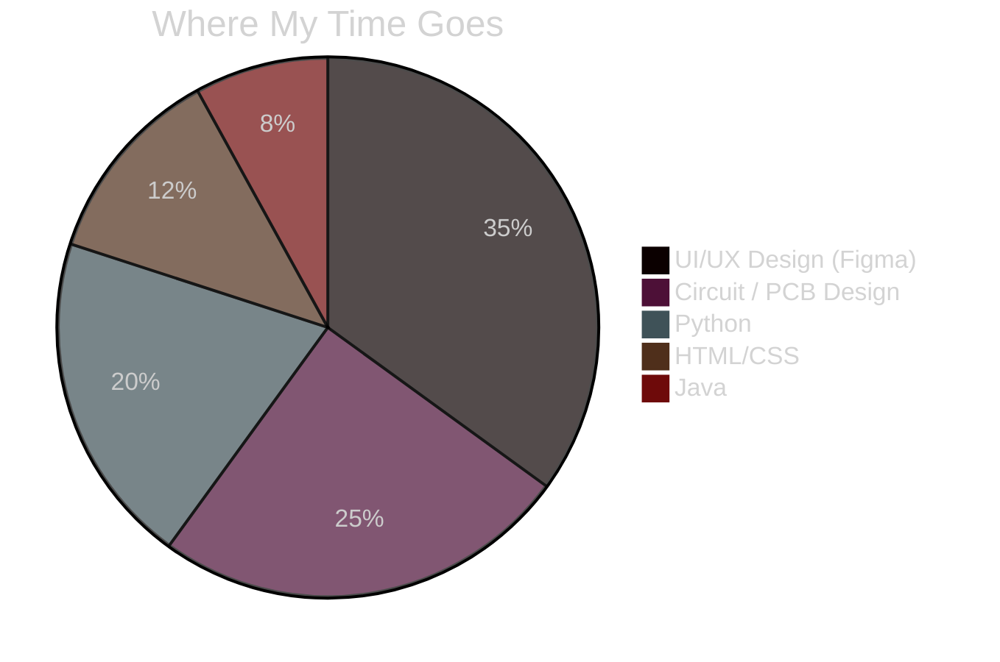
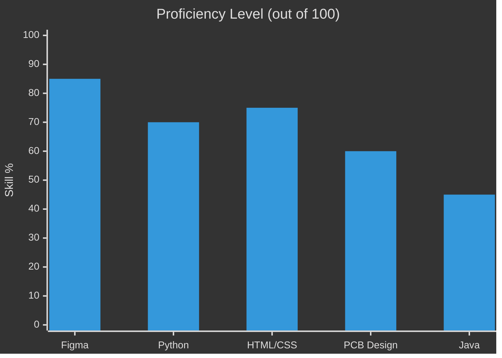
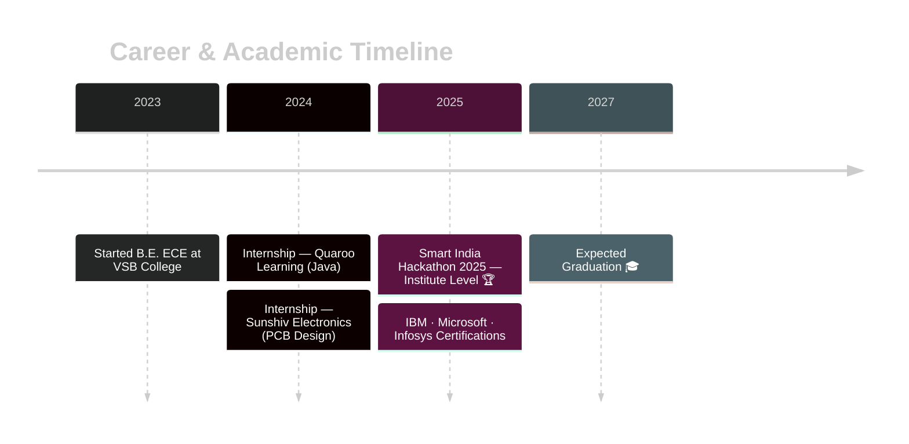

<svg width="1200" height="300" viewBox="0 0 1200 300" xmlns="http://www.w3.org/2000/svg">
  <defs>
    <linearGradient id="bgGrad" x1="0%" y1="0%" x2="100%" y2="100%">
      <stop offset="0%" stop-color="#0f0c29"/>
      <stop offset="45%" stop-color="#302b63"/>
      <stop offset="100%" stop-color="#24243e"/>
    </linearGradient>
    <linearGradient id="accentGrad" x1="0%" y1="0%" x2="100%" y2="0%">
      <stop offset="0%" stop-color="#00f5d4">
        <animate attributeName="offset" values="0;0.3;0" dur="4s" repeatCount="indefinite"/>
      </stop>
      <stop offset="50%" stop-color="#a855f7"/>
      <stop offset="100%" stop-color="#f72585">
        <animate attributeName="offset" values="1;0.7;1" dur="4s" repeatCount="indefinite"/>
      </stop>
    </linearGradient>
    <filter id="glow" x="-50%" y="-50%" width="200%" height="200%">
      <feGaussianBlur stdDeviation="3" result="blur"/>
      <feMerge>
        <feMergeNode in="blur"/>
        <feMergeNode in="SourceGraphic"/>
      </feMerge>
    </filter>
  </defs>

  <!-- Background -->
  <rect width="1200" height="300" fill="url(#bgGrad)"/>

  <!-- Circuit trace lines (left side) - animated "current flow" -->
  <g stroke="#00f5d4" stroke-width="1.5" fill="none" opacity="0.45">
    <path d="M0,40 H90 L110,60 H220 L240,40 H340" stroke-dasharray="8 6">
      <animate attributeName="stroke-dashoffset" from="0" to="-28" dur="1.5s" repeatCount="indefinite"/>
    </path>
    <path d="M0,90 H60 L80,110 H180" stroke-dasharray="8 6">
      <animate attributeName="stroke-dashoffset" from="0" to="-28" dur="2s" repeatCount="indefinite"/>
    </path>
    <path d="M0,140 H130 L150,160 H260 L280,140 H400" stroke-dasharray="8 6">
      <animate attributeName="stroke-dashoffset" from="0" to="-28" dur="1.8s" repeatCount="indefinite"/>
    </path>
    <path d="M0,220 H70 L90,240 H200 L220,260 H320" stroke-dasharray="8 6">
      <animate attributeName="stroke-dashoffset" from="0" to="-28" dur="2.2s" repeatCount="indefinite"/>
    </path>
    <path d="M0,270 H100 L120,250 H210" stroke-dasharray="8 6">
      <animate attributeName="stroke-dashoffset" from="0" to="-28" dur="1.6s" repeatCount="indefinite"/>
    </path>
  </g>
  <g fill="#00f5d4">
    <circle cx="90" cy="40" r="3"><animate attributeName="opacity" values="0.3;1;0.3" dur="1.5s" repeatCount="indefinite"/></circle>
    <circle cx="220" cy="60" r="3"><animate attributeName="opacity" values="0.3;1;0.3" dur="1.8s" repeatCount="indefinite"/></circle>
    <circle cx="60" cy="90" r="3"><animate attributeName="opacity" values="0.3;1;0.3" dur="2s" repeatCount="indefinite"/></circle>
    <circle cx="180" cy="110" r="3"><animate attributeName="opacity" values="0.3;1;0.3" dur="1.6s" repeatCount="indefinite"/></circle>
    <circle cx="130" cy="140" r="3"><animate attributeName="opacity" values="0.3;1;0.3" dur="1.9s" repeatCount="indefinite"/></circle>
    <circle cx="260" cy="160" r="3"><animate attributeName="opacity" values="0.3;1;0.3" dur="1.4s" repeatCount="indefinite"/></circle>
    <circle cx="70" cy="220" r="3"><animate attributeName="opacity" values="0.3;1;0.3" dur="2.1s" repeatCount="indefinite"/></circle>
    <circle cx="200" cy="240" r="3"><animate attributeName="opacity" values="0.3;1;0.3" dur="1.7s" repeatCount="indefinite"/></circle>
    <circle cx="100" cy="270" r="3"><animate attributeName="opacity" values="0.3;1;0.3" dur="2.3s" repeatCount="indefinite"/></circle>
  </g>

  <!-- Circuit trace lines (right side) - animated -->
  <g stroke="#f72585" stroke-width="1.5" fill="none" opacity="0.4">
    <path d="M1200,50 H1110 L1090,70 H980" stroke-dasharray="8 6">
      <animate attributeName="stroke-dashoffset" from="0" to="28" dur="1.7s" repeatCount="indefinite"/>
    </path>
    <path d="M1200,100 H1140 L1120,120 H1020 L1000,100 H900" stroke-dasharray="8 6">
      <animate attributeName="stroke-dashoffset" from="0" to="28" dur="2.1s" repeatCount="indefinite"/>
    </path>
    <path d="M1200,180 H1080 L1060,200 H950" stroke-dasharray="8 6">
      <animate attributeName="stroke-dashoffset" from="0" to="28" dur="1.9s" repeatCount="indefinite"/>
    </path>
    <path d="M1200,230 H1130 L1110,250 H1000 L980,230 H880" stroke-dasharray="8 6">
      <animate attributeName="stroke-dashoffset" from="0" to="28" dur="1.5s" repeatCount="indefinite"/>
    </path>
  </g>
  <g fill="#f72585">
    <circle cx="1110" cy="50" r="3"><animate attributeName="opacity" values="0.3;1;0.3" dur="1.6s" repeatCount="indefinite"/></circle>
    <circle cx="980" cy="70" r="3"><animate attributeName="opacity" values="0.3;1;0.3" dur="1.9s" repeatCount="indefinite"/></circle>
    <circle cx="1000" cy="100" r="3"><animate attributeName="opacity" values="0.3;1;0.3" dur="2.2s" repeatCount="indefinite"/></circle>
    <circle cx="900" cy="100" r="3"><animate attributeName="opacity" values="0.3;1;0.3" dur="1.5s" repeatCount="indefinite"/></circle>
    <circle cx="1080" cy="180" r="3"><animate attributeName="opacity" values="0.3;1;0.3" dur="1.8s" repeatCount="indefinite"/></circle>
    <circle cx="950" cy="200" r="3"><animate attributeName="opacity" values="0.3;1;0.3" dur="2s" repeatCount="indefinite"/></circle>
    <circle cx="980" cy="230" r="3"><animate attributeName="opacity" values="0.3;1;0.3" dur="1.7s" repeatCount="indefinite"/></circle>
    <circle cx="880" cy="230" r="3"><animate attributeName="opacity" values="0.3;1;0.3" dur="2.4s" repeatCount="indefinite"/></circle>
  </g>

  <!-- Accent top/bottom bars -->
  <rect x="0" y="0" width="1200" height="6" fill="url(#accentGrad)"/>
  <rect x="0" y="294" width="1200" height="6" fill="url(#accentGrad)"/>

  <!-- Main title with pulsing glow -->
  <text x="600" y="135" text-anchor="middle" font-family="'Segoe UI', Arial, sans-serif" font-size="46" font-weight="800" fill="#ffffff" filter="url(#glow)">
    SUBAKEERTHANA K
    <animate attributeName="opacity" values="0.85;1;0.85" dur="3s" repeatCount="indefinite"/>
  </text>

  <text x="600" y="175" text-anchor="middle" font-family="'Segoe UI', Arial, sans-serif" font-size="18" font-weight="400" fill="#c9c9e8" letter-spacing="1">
    Electronics &amp; Communication Engineer  •  UI/UX Designer
  </text>

  <!-- Tag pills with subtle pulse -->
  <g font-family="'Segoe UI', Arial, sans-serif" font-size="13" font-weight="600">
    <rect x="395" y="205" width="90" height="30" rx="15" fill="none" stroke="#00f5d4" stroke-width="1.2">
      <animate attributeName="stroke-opacity" values="0.5;1;0.5" dur="2.5s" repeatCount="indefinite"/>
    </rect>
    <text x="440" y="224" text-anchor="middle" fill="#00f5d4">FIGMA</text>

    <rect x="497" y="205" width="110" height="30" rx="15" fill="none" stroke="#a855f7" stroke-width="1.2">
      <animate attributeName="stroke-opacity" values="0.5;1;0.5" dur="2.8s" repeatCount="indefinite"/>
    </rect>
    <text x="552" y="224" text-anchor="middle" fill="#a855f7">CIRCUIT DESIGN</text>

    <rect x="619" y="205" width="90" height="30" rx="15" fill="none" stroke="#f72585" stroke-width="1.2">
      <animate attributeName="stroke-opacity" values="0.5;1;0.5" dur="2.2s" repeatCount="indefinite"/>
    </rect>
    <text x="664" y="224" text-anchor="middle" fill="#f72585">PYTHON</text>

    <rect x="721" y="205" width="85" height="30" rx="15" fill="none" stroke="#00f5d4" stroke-width="1.2">
      <animate attributeName="stroke-opacity" values="0.5;1;0.5" dur="3s" repeatCount="indefinite"/>
    </rect>
    <text x="763" y="224" text-anchor="middle" fill="#00f5d4">JAVA</text>
  </g>

  <!-- Bottom tagline -->
  <text x="600" y="268" text-anchor="middle" font-family="'Segoe UI', Arial, sans-serif" font-size="13" font-style="italic" fill="#8888b0">
    Where circuits meet interfaces
  </text>
</svg>

 

  

 

## 🧭 About Me

> Final-year **B.E. Electronics and Communication Engineering** student at V.S.B College of Engineering Technical Campus, Coimbatore — CGPA **8.41**.
> I move between **Figma frames and circuit boards**, treating design and hardware as one continuous practice — the same instinct for clarity that shapes a wireframe also shapes a circuit board.

 

## 🥧 Skill Distribution

 

## 📈 Skills at a Glance

 

## 🗺️ My Journey

 

## 🛠️ Tech Stack

<table>
<tr>
<td align="center" width="96">
 Python
</td>
<td align="center" width="96">
 Java
</td>
<td align="center" width="96">
 HTML5
</td>
<td align="center" width="96">
 CSS3
</td>
<td align="center" width="96">
 Figma
</td>
<td align="center" width="96">
 Git
</td>
<td align="center" width="96">
 GitHub
</td>
<td align="center" width="96">
 VS Code
</td>
</tr>
</table>

 

## 🐍 Contribution Snake (animated)

<b>⚙️ How to activate this animation (one-time setup, 3 minutes)</b>

 

This snake animates itself by "eating" your actual contribution graph. It needs a small GitHub Action to generate it — the image above stays broken until you do this once:

1. In your `Subakeerthana-K/Subakeerthana-K` repo, go to **Actions → New workflow → set up a workflow yourself**.
2. Name the file `snake.yml` and paste in the workflow from `Platane/snk` (search "Platane snk github action" for the exact YAML — it's a well-known, widely-starred action).
3. Commit the workflow. Go to the **Actions** tab and manually run it once (▶️ Run workflow).
4. It will auto-create an `output` branch with the generated SVG — matching the URL already in this README.
5. After that, it re-runs daily on its own via a cron schedule already included in the workflow.

 

## 🚀 Featured Projects

<table>
<tr>
<td width="50%" valign="top">

### 🍔 Food Ordering App — UI/UX
Designed and prototyped a full food ordering mobile app in Figma with responsive layouts, intuitive navigation, and interactive screens.

`Figma` `Mobile UI` `Prototyping`

</td>
<td width="50%" valign="top">

### ⚡ Piezoelectric Power Board
Hardware system that harnesses mechanical vibrations using piezoelectric materials, converting them into usable electrical energy.

`Circuit Design` `Energy Harvesting`

</td>
</tr>
<tr>
<td width="50%" valign="top">

### 🎓 SIH 2025 — Career Advisor
Led a team building a "One-Stop Personalized Career & Education Advisor" UI/UX prototype. **Selected at institute level.**

`Figma` `Leadership` `UX Research`

</td>
<td width="50%" valign="top">

### 🔥 Fire Safeguard Emergency Robot
Intelligent robotic system with GPS and autonomous monitoring to assist in fire emergency management.

`Robotics` `GPS` `Safety Systems`

</td>
</tr>
</table>

 

## 📜 Certifications

 

## 📬 Let's Connect

I'm open to opportunities in **UI/UX Design** and **Electronics Engineering** — always happy to collaborate on interesting projects!

