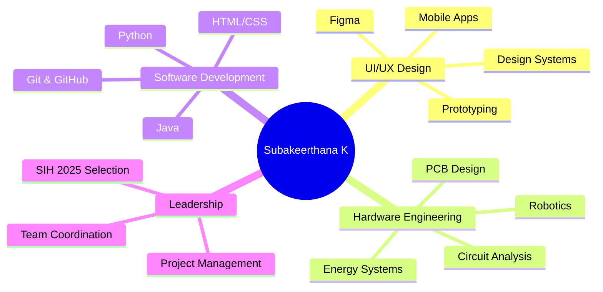
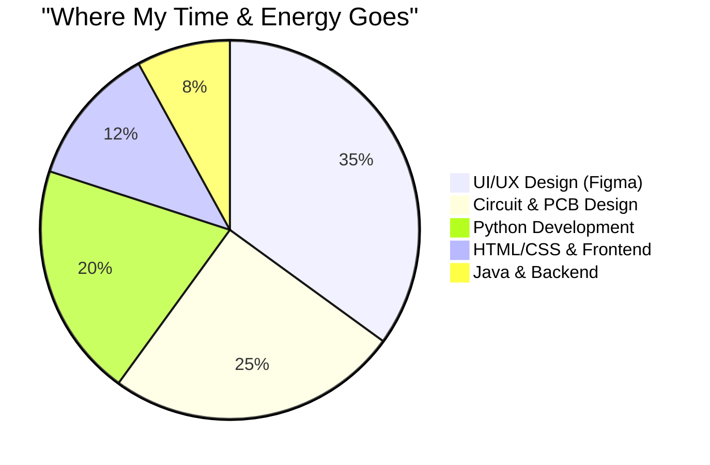
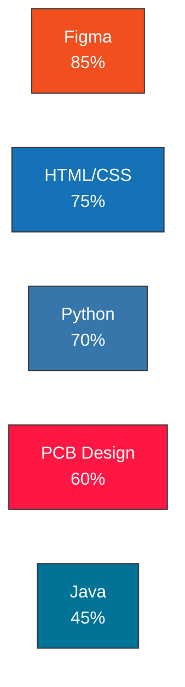
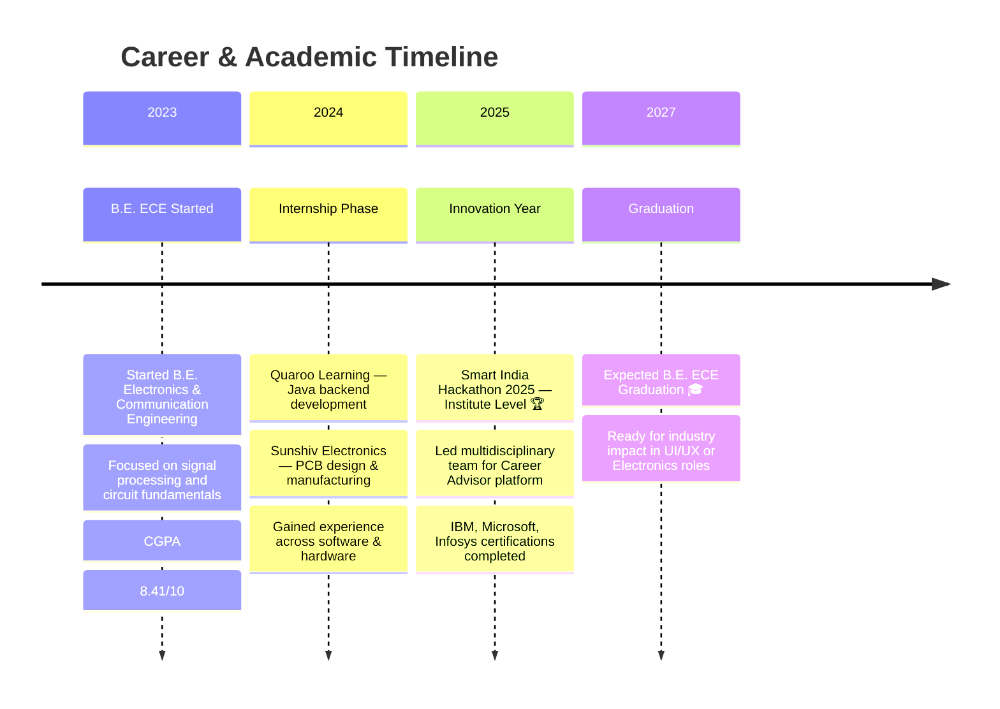

  <h3>🎨 Designing Interfaces by Day, Debugging Circuits by Night ⚡</h3>   

  

 

---

## 🧭 About Me

> Final-year **B.E. Electronics and Communication Engineering** student at V.S.B College of Engineering Technical Campus, Coimbatore — **CGPA 8.41/10**.
>
> I move between **Figma frames and circuit boards**, treating design and hardware as one continuous practice — the same instinct for clarity that shapes a wireframe also shapes a circuit board.

 

## 🎯 Core Competencies

 

## 📊 Skills Distribution

 

## 📈 Technical Proficiency

 

## 🛠️ Tech Stack

<table>
<tr>
<td align="center" width="96">
 Python
</td>
<td align="center" width="96">
 Java
</td>
<td align="center" width="96">
 HTML5
</td>
<td align="center" width="96">
 CSS3
</td>
<td align="center" width="96">
 Figma
</td>
<td align="center" width="96">
 Git
</td>
<td align="center" width="96">
 GitHub
</td>
<td align="center" width="96">
 VS Code
</td>
</tr>
</table>

*All icons served from jsDelivr's devicon CDN — high-uptime, globally distributed*

 

## 📅 My Journey

 

## 🚀 Featured Projects

<table>
<tr>
<td width="50%" valign="top">

### 🍔 Food Ordering App — UI/UX
**Full-stack design system for mobile food ordering**

- Complete UI/UX design in Figma
- Responsive layouts & intuitive navigation
- Interactive high-fidelity prototypes
- Reusable component library

`Figma` `Mobile UI` `Prototyping` `Design Systems`

</td>
<td width="50%" valign="top">

### ⚡ Piezoelectric Power Board
**Energy harvesting from mechanical vibrations**

- Hardware system design for energy conversion
- Custom PCB layout & circuit optimization
- Real-world applications: wearables, IoT, sensors
- Practical implementation of electromagnetic principles

`Circuit Design` `PCB Layout` `Energy Harvesting` `Hardware`

</td>
</tr>
<tr>
<td width="50%" valign="top">

### 🎓 SIH 2025 — Career Advisor Platform
**Selected at Institute Level** 🏆

- Led multidisciplinary team (UI/UX focus)
- Personalized career & education guidance platform
- Comprehensive UX research & user testing
- High-fidelity prototype & design specifications

`Figma` `Leadership` `UX Research` `Team Management`

</td>
<td width="50%" valign="top">

### 🔥 Fire Safeguard Emergency Robot
**Autonomous safety & emergency response system**

- Intelligent robotic system with GPS tracking
- Real-time autonomous monitoring capabilities
- Designed for fire emergency management
- Hardware + firmware integration

`Robotics` `GPS Navigation` `Safety Systems` `Hardware Integration`

</td>
</tr>
</table>

 

## 📜 Certifications & Credentials

| Certification | Issuer | Focus |
|:---|:---|:---|
| **Python for Data Science & AI** | IBM | Data Science, ML Foundations |
| **Networking & Cloud Computing** | Microsoft | Cloud Infrastructure |
| **VLSI & Verilog Fundamentals** | Infosys Springboard | Digital Design |
| **Career Edge Program** | TCS iON | Professional Development |
| **Prompt Engineering** | Error Makes Clever | AI & LLM Interactions |

 

## 💡 What Drives Me

- ✨ **Intuitive Design** — Creating interfaces that feel natural and delight users
- ⚡ **Hardware Innovation** — Building systems where every component serves a purpose
- 🔧 **Problem Solving** — Turning complex challenges into elegant solutions
- 🤝 **Collaboration** — Thriving in diverse teams with complementary expertise
- 📚 **Continuous Learning** — Staying updated with design trends and hardware advances

 

---

## 📬 Let's Connect & Collaborate

I'm actively seeking opportunities in **UI/UX Design**, **Product Design**, and **Electronics Engineering**. Whether you have a design challenge, a hardware project, or just want to connect—I'd love to hear from you!

 

**Let's collaborate. Let's innovate. Let's create impact.** ✨

---

  <i>Made with 🎨 & ⚡ by Subakeerthana K</i>

